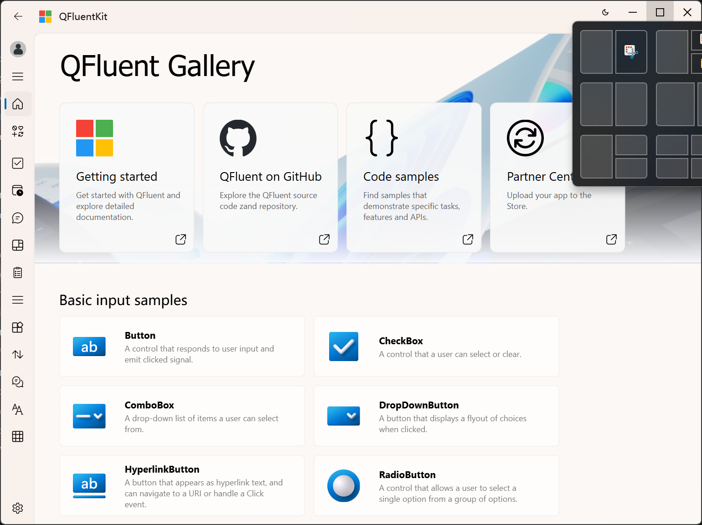
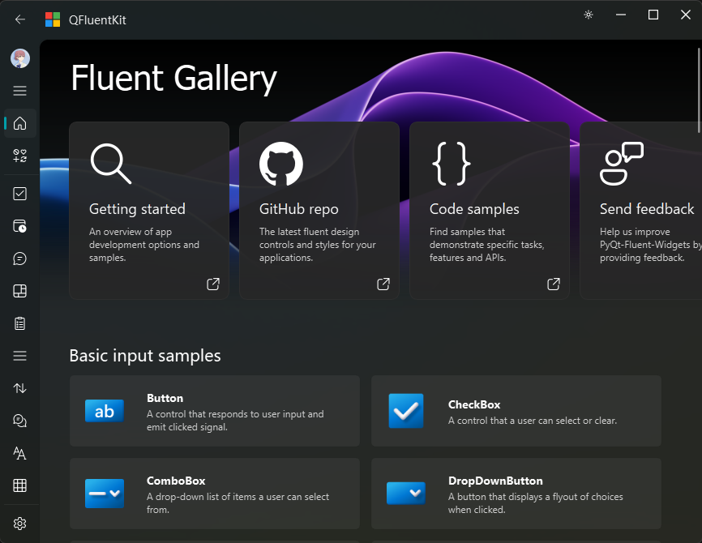

# QFluentKit

**QFluentKit** 是一个基于 Qt Widgets 的 Fluent Design 风格 UI 组件库，致力于为 Qt C++ 开发者提供现代化、美观且易用的界面解决方案。

## 🌟 特性亮点

- **Fluent Design 风格**：遵循微软 Fluent Design 设计语言，带来现代、一致的视觉体验。
- **无边框窗口支持**：集成 QWindowKit 实现优雅的无边框窗口管理（包括拖拽、缩放、阴影等）。
- **跨版本兼容**：动态库支持 **Qt 5.15+** 和 **Qt 6**（兼容 MinGW 与 MSVC 编译器）。
- **开箱即用**：本项目展示了如何在实际应用中集成和使用 QFluentKit 动态库。

## 📸 示例截图

## 🛠️ 构建环境

- **操作系统**：Windows 10 或更高版本
- **Qt 版本**：≥ 5.15
- **主分支构建配置**：
  - Qt 6.8.3
  - MSVC 2022 64-bit

> 💡 提示：虽然主分支基于 Qt 6.8.3 + MSVC 构建，但 QFluentKit 动态库本身兼容 Qt 5.15 及 Qt 6 的多种编译环境（MinGW / MSVC）。

## 📦 依赖与参考

- 核心窗口管理：QWindowKit
- 设计灵感来源：PyQt-Fluent-Widgets

## 📺 在线演示

想先看看效果？欢迎观看 Bilibili 演示视频！

## 📄 许可证

本项目采用**自定义免费使用许可**。
免费供个人和商业项目使用。
基于 Qt 开源版（LGPL）开发。
保留版权、禁止反编译、免责。
完整许可条款请参阅项目根目录下的 `LICENSE` 文件。