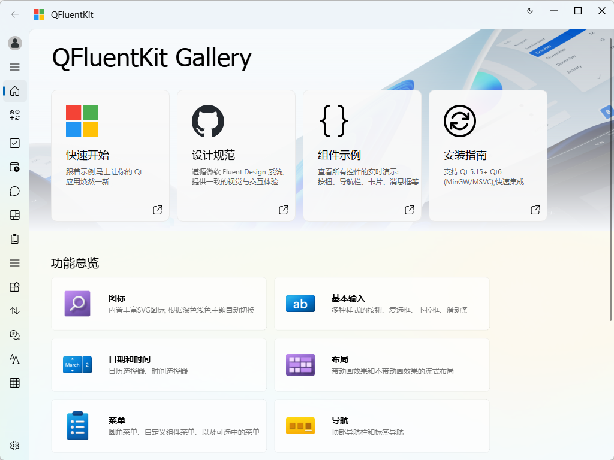
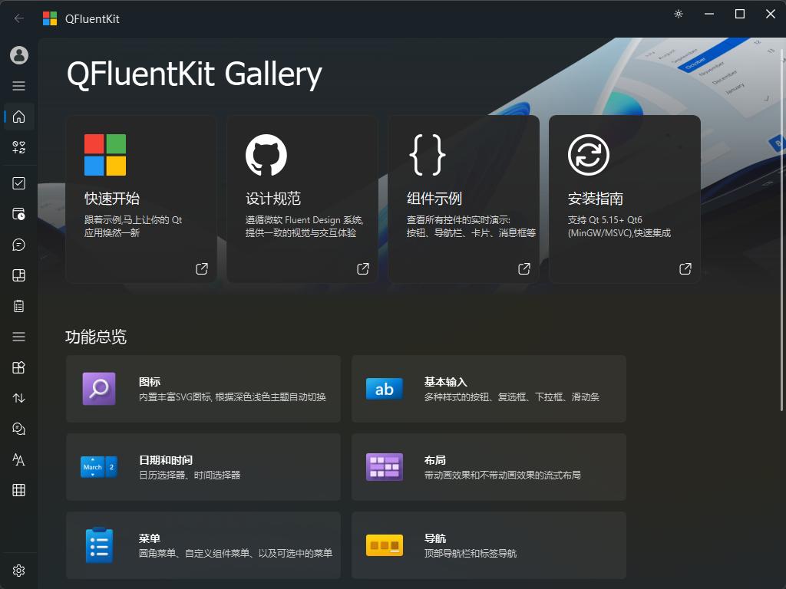

# QFluentKit - 项目存档通知

> ⭐ **重大惊喜**：QFluentKit 库现已**完全开源**！本项目不再维护。
> 
> 🎉 **官方开源库地址**：[QFluentKit 官方仓库](https://github.com/toddming/QFluentKit.git)
>
> 🐧 **QQ交流群: 1084320682**
> 
> **为什么选择官方开源库？**
> - ✅ 完整源代码，自由查看与定制
> - ✅ 积极维护与社区支持
> - ✅ 持续功能更新与bug修复
> - ✅ 透明的开发流程

---

**QFluentKit** 是一个基于 Qt Widgets 的 Fluent Design 风格 UI 组件库，致力于为 Qt C++ 开发者提供现代化、美观且易用的界面解决方案。

## 🌟 特性亮点

- **Fluent Design 风格**：遵循微软 Fluent Design 设计语言，带来现代、一致的视觉体验。
- **无边框窗口支持**：集成 QWindowKit 实现优雅的无边框窗口管理（包括拖拽、缩放、阴影等）。
- **跨版本兼容**：动态库支持 **Qt 5.15+** 和 **Qt 6**（兼容 MinGW 与 MSVC 编译器）。
- **开箱即用**：本项目展示了如何在实际应用中集成和使用 QFluentKit 动态库。

> 💡 **现在可以直接使用官方开源版**！获得完整源代码、自由定制和社区支持。

## 📸 示例截图

## 🛠️ 构建环境

- **操作系统**：Windows 10 或更高版本
- **Qt 版本**：≥ 5.15
- **主分支构建配置**：
  - Qt 6.8.3 / Qt 5.15.2
  - MSVC 2022 64-bit

> 💡 主分支可在 Qt 6.8.3 + MSVC 或 Qt 5.15.2 + MSVC 环境下直接构建并运行。QFluentKit 动态库本身兼容 Qt 5.15 及 Qt 6 的多个版本，并支持 MinGW 与 MSVC 编译器；但本仓库的示例程序仅预置了上述两种 MSVC 环境（Qt 6.8.3 / Qt 5.15.2）构建的动态库。

## 📦 依赖与参考

- 核心窗口管理：[QWindowKit](https://github.com/stdware/qwindowkit)
- 设计灵感来源：[PyQt-Fluent-Widgets](https://github.com/zhiyiYo/PyQt-Fluent-Widgets)

## 📺 在线演示

想先看看效果？欢迎观看 [Bilibili 演示视频](https://www.bilibili.com/video/BV1p211BmEpa/)！

## 📄 许可证与项目状态

> **此项目已不再维护** ⚠️ 
>
> 由于 QFluentKit 库现已完全开源，本项目的演示和动态库已无需维护。如需最新的功能、bug修复和社区支持，**强烈推荐直接使用官方开源库**：
>
> 👉 [QFluentKit 官方开源库 - GitHub](https://github.com/toddming/QFluentKit.git)

**官方库采用开源许可**（具体许可证详见官方仓库），包含：
- 完整源代码，可自由修改与扩展
- 活跃维护与持续更新
- 社区驱动的功能开发
- 透明的 issue 跟踪与讨论

**此存档项目的原许可**：
- 采用自定义免费使用许可
- 免费供个人和商业项目使用
- 基于 Qt 开源版（LGPL）开发
